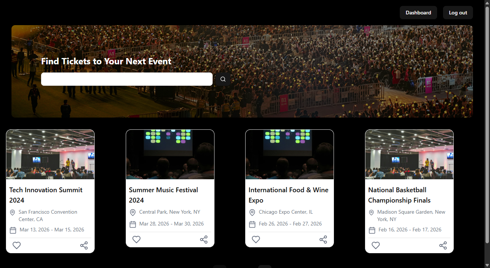
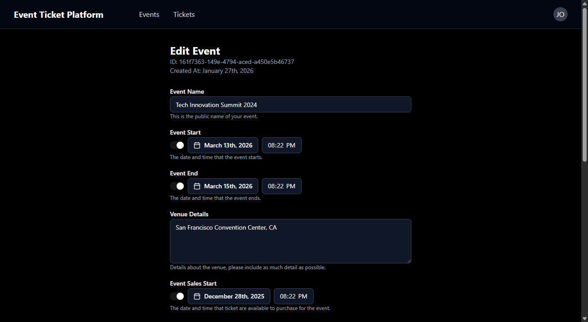
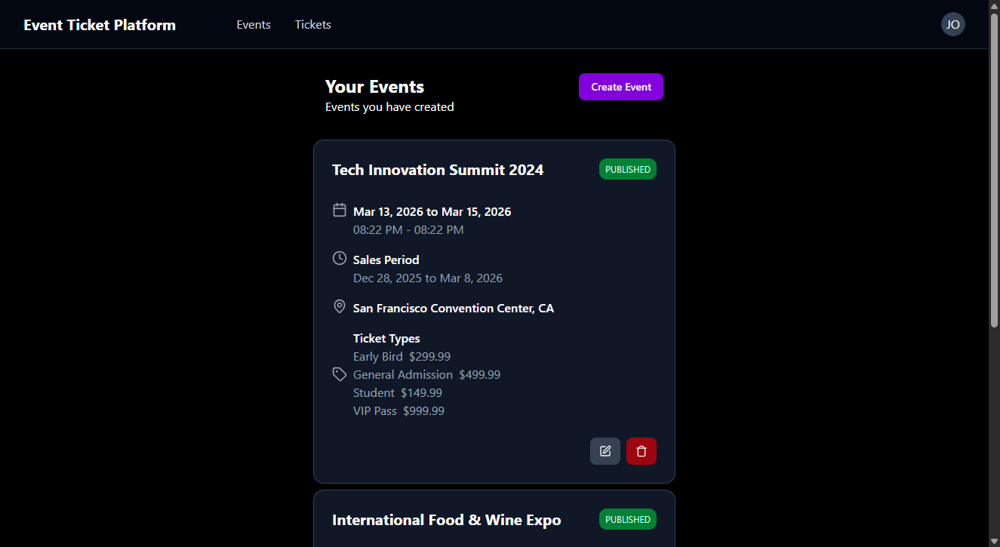
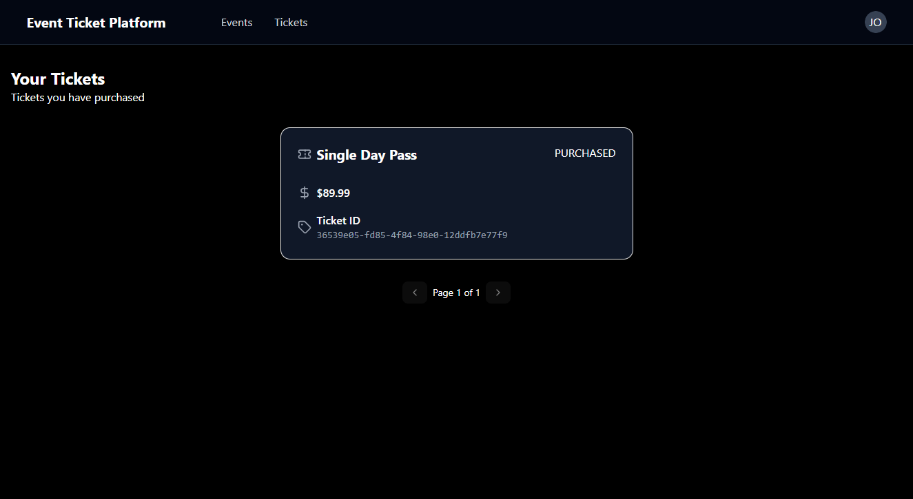
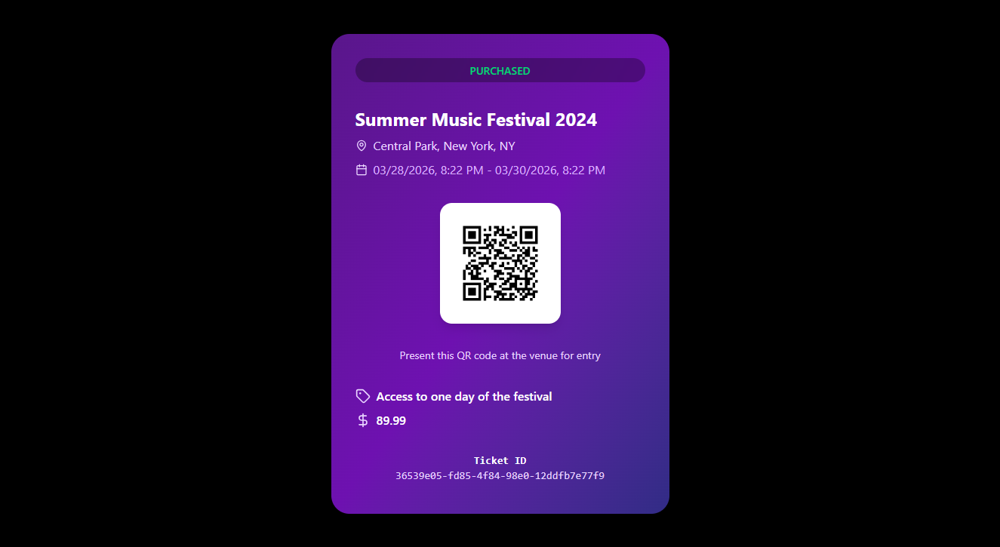
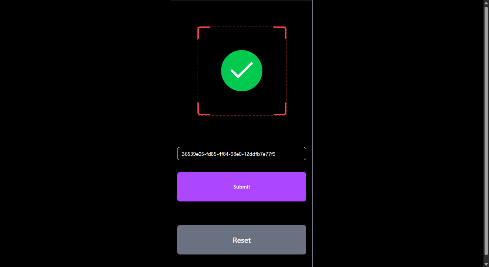

# 🎟️ Event Ticket Platform

A full-stack event ticketing platform that enables event organizers to create and manage events while allowing attendees to discover, purchase, and validate tickets with QR code technology.


## 📋 Table of Contents

- [Overview](#overview)
- [Features](#features)
- [Tech Stack](#tech-stack)
- [Architecture](#architecture)
- [Getting Started](#getting-started)
  - [Prerequisites](#prerequisites)
  - [Backend Setup](#backend-setup)
  - [Frontend Setup](#frontend-setup)
- [API Documentation](#api-documentation)
- [Screenshots](#screenshots)
- [Project Structure](#project-structure)
- [Security](#security)
- [Contributing](#contributing)
- [License](#license)
- [Contact](#contact)

## 🎯 Overview

The Event Ticket Platform is a modern, secure, and scalable solution for event management and ticketing. Built with enterprise-grade technologies, it provides a seamless experience for both event organizers and attendees.

**Key Highlights:**
- 🔐 Secure authentication and authorization using OAuth 2.0 and JWT
- 📱 QR code generation and validation for tickets
- 🎨 Modern, responsive UI built with React and TailwindCSS
- 🚀 RESTful API with Spring Boot
- 🗄️ PostgreSQL database with JPA/Hibernate
- 🔑 Keycloak integration for identity and access management

## ✨ Features

### For Event Organizers
- **Event Management**
  - Create, update, and delete events
  - Set event details (name, description, location, date/time)
  - Manage event status (draft, published, cancelled)
  - View event analytics and ticket sales

- **Ticket Type Management**
  - Create multiple ticket types per event (VIP, General, Early Bird, etc.)
  - Set pricing and availability for each ticket type
  - Track ticket sales in real-time

- **Ticket Validation**
  - QR code scanner for ticket validation at event entrance
  - Real-time validation status
  - Prevent duplicate ticket usage

### For Attendees
- **Event Discovery**
  - Browse published events
  - Search events by name or description
  - View detailed event information and available ticket types

- **Ticket Purchase**
  - Secure ticket purchasing
  - Automatic QR code generation
  - View purchased tickets in dashboard

- **Ticket Management**
  - Access all purchased tickets
  - Download QR codes for event entry
  - View ticket details and event information

### Security Features
- OAuth 2.0 / OpenID Connect authentication
- JWT-based authorization
- Role-based access control (RBAC)
- Secure password handling via Keycloak
- CORS protection
- Protected API endpoints

## 🛠️ Tech Stack

### Backend
- **Framework:** Spring Boot 4.0.1
- **Language:** Java 21
- **Security:** Spring Security, OAuth 2.0 Resource Server
- **Database:** PostgreSQL (with H2 for development)
- **ORM:** Spring Data JPA / Hibernate
- **Validation:** Bean Validation (Jakarta Validation)
- **Mapping:** MapStruct 1.6.3
- **QR Code:** ZXing (Zebra Crossing) 3.5.4
- **Build Tool:** Maven
- **Containerization:** Docker Compose

### Frontend
- **Framework:** React 19.0.0
- **Language:** TypeScript 5.7.2
- **Build Tool:** Vite 6.3.1
- **Styling:** TailwindCSS 4.1.4
- **UI Components:** Radix UI (AI-assisted with custom refinements)
- **Routing:** React Router 7.5.1
- **Authentication:** react-oidc-context 3.3.0
- **QR Scanner:** @yudiel/react-qr-scanner 2.3.1
- **Date Handling:** date-fns 3.6.0
- **Icons:** Lucide React

> **Note:** The UI components were initially generated using AI tools and then customized and refined to meet specific project requirements and maintain code quality standards.

### Infrastructure
- **Identity Provider:** Keycloak (latest)
- **Database:** PostgreSQL (latest)
- **Database Admin:** Adminer
- **Reverse Proxy:** Vite Dev Server (development)

## 🏗️ Architecture

The application follows a modern three-tier architecture:

```
┌─────────────────────────────────────────────────────────────┐
│                         Frontend                             │
│  React + TypeScript + TailwindCSS (Port 5173)               │
└─────────────────────────────────────────────────────────────┘
                            │
                            │ REST API / OAuth 2.0
                            ▼
┌─────────────────────────────────────────────────────────────┐
│                         Backend                              │
│  Spring Boot + Spring Security (Port 8080)                  │
│  ┌──────────────┐  ┌──────────────┐  ┌──────────────┐      │
│  │ Controllers  │  │   Services   │  │ Repositories │      │
│  └──────────────┘  └──────────────┘  └──────────────┘      │
└─────────────────────────────────────────────────────────────┘
                            │
                ┌───────────┴───────────┐
                ▼                       ▼
┌──────────────────────┐   ┌──────────────────────┐
│    PostgreSQL        │   │      Keycloak        │
│    (Port 5432)       │   │      (Port 9090)     │
└──────────────────────┘   └──────────────────────┘
```

### Key Design Patterns
- **Repository Pattern:** Data access abstraction
- **Service Layer Pattern:** Business logic separation
- **DTO Pattern:** Data transfer between layers
- **Dependency Injection:** Loose coupling via Spring IoC
- **RESTful API Design:** Standard HTTP methods and status codes

## 🚀 Getting Started

### Prerequisites

Before you begin, ensure you have the following installed:
- **Java Development Kit (JDK) 21** or higher
- **Maven 3.8+**
- **Node.js 18+** and **npm**
- **Docker** and **Docker Compose**
- **Git**

### Backend Setup

1. **Clone the repository**
   ```bash
   git clone https://github.com/amirelkased/EventTicketPlatform.git
   cd EventTicketPlatform
   ```

2. **Start infrastructure services (PostgreSQL, Keycloak, Adminer)**
   ```bash
   cd Event-Ticket-Platform-api
   docker-compose up -d
   ```

3. **Configure Keycloak**
   - Access Keycloak at `http://localhost:9090`
   - Login with credentials: `admin` / `admin`
   - Create a new realm named `event-ticket-platform`
   - Create a client named `event-ticket-platform-app`
     - Client Protocol: `openid-connect`
     - Access Type: `public`
     - Valid Redirect URIs: `http://localhost:5173/*`
     - Web Origins: `http://localhost:5173`
   - Create roles: `ORGANIZER`, `ATTENDEE`
   - Create test users and assign roles

4. **Configure database**
   - The application will automatically create the database schema
   - Database connection details are in `application.properties`:
     - URL: `jdbc:postgresql://localhost:5432/event_ticket_platform`
     - Username: `postgres`
     - Password: `root`

5. **Build and run the backend**
   ```bash
   mvn clean install
   mvn spring-boot:run
   ```

   The API will be available at `http://localhost:8080`

### Frontend Setup

1. **Navigate to the UI directory**
   ```bash
   cd Event-Ticket-Platform-ui
   ```

2. **Install dependencies**
   ```bash
   npm install
   ```

3. **Start the development server**
   ```bash
   npm run dev
   ```

   The application will be available at `http://localhost:5173`

4. **Build for production**
   ```bash
   npm run build
   ```

### Accessing the Application

- **Frontend:** http://localhost:5173
- **Backend API:** http://localhost:8080/api/v1
- **Keycloak Admin:** http://localhost:9090
- **Database Admin (Adminer):** http://localhost:8888

## 📚 API Documentation

### Authentication
All protected endpoints require a valid JWT token in the Authorization header:
```
Authorization: Bearer <your-jwt-token>
```

### Main Endpoints

#### Events (Organizer)
- `POST /api/v1/events/create` - Create a new event
- `GET /api/v1/events` - List all events (paginated)
- `GET /api/v1/events/{id}` - Get event details
- `PUT /api/v1/events/{id}` - Update event
- `DELETE /api/v1/events/{id}` - Delete event

#### Published Events (Public)
- `GET /api/v1/published-events` - List published events (paginated)
- `GET /api/v1/published-events?q={query}` - Search published events
- `GET /api/v1/published-events/{id}` - Get published event details

#### Tickets
- `POST /api/v1/events/{eventId}/ticket-types/{ticketTypeId}/tickets` - Purchase ticket
- `GET /api/v1/tickets` - List user's tickets (paginated)
- `GET /api/v1/tickets/{id}` - Get ticket details
- `GET /api/v1/tickets/{id}/qr-codes` - Get ticket QR code (image)

#### Ticket Validation
- `POST /api/v1/ticket-validations` - Validate a ticket via QR code


## 📸 Screenshots

> **Note:** Add screenshots of your application here to showcase the UI and features.

### Landing Page


### Event Discovery


### Organizer Dashboard


### Ticket Management


### QR Code


### QR Code Validation


## 📁 Project Structure

### Backend Structure
```
Event-Ticket-Platform-api/
├── src/main/java/org/elkased/eventticketplatform/
│   ├── config/              # Security, JPA, QR code configuration
│   ├── controllers/         # REST API endpoints
│   ├── domain/
│   │   ├── dtos/           # Data Transfer Objects
│   │   └── entities/       # JPA entities
│   ├── exceptions/         # Custom exceptions
│   ├── filters/            # Security filters
│   ├── mappers/            # MapStruct mappers
│   ├── repositories/       # Spring Data JPA repositories
│   ├── services/           # Business logic
│   └── util/               # Utility classes
├── src/main/resources/
│   └── application.properties
├── docker-compose.yaml
└── pom.xml
```

### Frontend Structure
```
Event-Ticket-Platform-ui/
├── src/
│   ├── components/         # Reusable UI components
│   │   └── ui/            # Radix UI components
│   ├── domain/            # TypeScript types/interfaces
│   ├── hooks/             # Custom React hooks
│   ├── lib/               # API client and utilities
│   ├── pages/             # Page components
│   └── main.tsx           # Application entry point
├── public/
├── package.json
└── vite.config.ts
```

## 🔒 Security

This application implements multiple security layers:

1. **Authentication:** OAuth 2.0 / OpenID Connect via Keycloak
2. **Authorization:** JWT-based with role-based access control
3. **Password Security:** Managed by Keycloak (bcrypt hashing)
4. **API Security:** Spring Security with OAuth 2.0 Resource Server
5. **CORS Protection:** Configured for specific origins
6. **Input Validation:** Bean Validation on all DTOs
7. **SQL Injection Prevention:** JPA/Hibernate parameterized queries

### User Roles
- **ATTENDEE:** Can browse events, purchase tickets, view their tickets
- **ORGANIZER:** Can create/manage events, validate tickets, plus all attendee permissions

## 🤝 Contributing

Contributions are welcome! Please follow these steps:

1. Fork the repository
2. Create a feature branch (`git checkout -b feature/AmazingFeature`)
3. Commit your changes (`git commit -m 'Add some AmazingFeature'`)
4. Push to the branch (`git push origin feature/AmazingFeature`)
5. Open a Pull Request

## 📄 License

This project is licensed under the MIT License - see the [LICENSE](LICENSE) file for details.

## 👤 Contact

**Amir Elkased**

- GitHub: [@amirelkased](https://github.com/amirelkased)
- LinkedIn: [Amir Elkased](https://linkedin.com/in/amirelkased)
- Email: amirelkased.dev@gmail.com

---

⭐ If you found this project helpful, please consider giving it a star!

## 🙏 Acknowledgments

- [Spring Boot](https://spring.io/projects/spring-boot)
- [React](https://react.dev/)
- [Keycloak](https://www.keycloak.org/)
- [TailwindCSS](https://tailwindcss.com/)
- [Radix UI](https://www.radix-ui.com/)
- [ZXing](https://github.com/zxing/zxing)